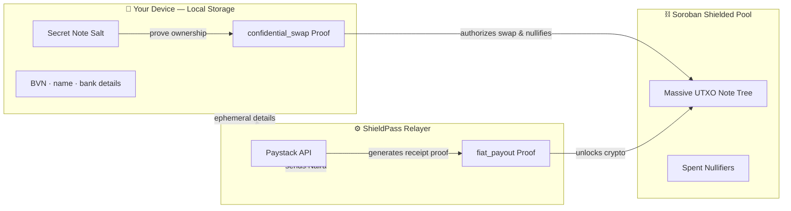

<p align="center">
  
</p>

# 🛡️ ShieldPass

### Ultimate Privacy: Trustless Crypto → Fiat Off-Ramp on Stellar

ShieldPass is a private cross-border remittance corridor. It lets anyone swap crypto for Nigerian naira **instantly**, paid straight to their bank account — **without ever exposing their identity, swap amount, or banking data on-chain**. 

Your crypto is held in a cutting-edge **Shielded Pool**, not a standard escrow. You prove ownership of funds and compliance using **zero-knowledge proofs** generated locally on your device. The chain only ever sees mathematical proofs, never your BVN, name, swap amounts, or bank details. 

> **Built for the _Stellar Hacks: ZK_ hackathon.** ShieldPass is the "Holy Grail" of centralized off-ramps, completely bridging Web2 Nigerian banking APIs with Web3 smart contracts trustlessly.

<p align="center">
  <code>Shielded Pool</code> • <code>Zero-Storage Backend</code> • <code>Noir + Poseidon</code> • <code>Passkey Smart Wallets</code> • <code>Gasless</code>
</p>

---

## 🧭 The Ultimate Privacy Architecture (Old vs New Way)

Traditional off-ramps force you to upload your identity, trust a custodian with your funds, and publicly broadcast exactly how much money you are sending. ShieldPass completely eliminates all three vulnerabilities.

### 1. The Shielded Pool (The "Dark Pool")
<p align="center"></p>

* **Old Way:** When you sent money, everyone could see it sitting in an escrow account.
* **New Way:** All user funds are mixed together in one giant pool. When you deposit, you get a secret "ticket" (ZK Note). No one looking at the blockchain can tell which ticket belongs to you.

### 2. Private Faucet (Invisible Airdrops)
* **Old Way:** We sent you testnet XLM publicly so you could use the app, which meant chain-analysis tools could see exactly who we were onboarding.
* **New Way:** We mathematically generate a "ticket" with funds already on it and hand you the secret code. The blockchain never sees a transaction happen.

### 3. Confidential Swaps (Hidden Amounts)
* **Old Way:** The blockchain showed exactly how much crypto you were cashing out.
* **New Way:** When you cash out, a Zero-Knowledge proof runs on your phone. It mathematically proves you own a valid ticket and burns it, creating a new ticket with your "change." The blockchain only sees complex math, not your amounts.

### 4. Zero-Storage Banking (Hack-Proof Database)
<p align="center"></p>

* **Old Way:** We saved your Nigerian bank account number in our backend database so you could use it later. If we got hacked, the hackers got your banking info.
* **New Way:** We don't save your bank account *at all*. When you type in your bank, it saves to your phone's local storage. When you swap, your phone flashes the bank details to our backend for exactly 1 second, we pay the bank, and we instantly delete the info.

### 5. Trustless Fiat Payouts (zkTLS/Math-Enforced Escrow)
<p align="center"></p>

* **Old Way:** The smart contract trusted our backend. If our backend said "we paid the user," the contract gave us the crypto.
* **New Way:** The smart contract trusts *nobody*. Before the contract gives ShieldPass the crypto, our backend has to submit a cryptographic proof showing the Paystack receipt perfectly matches a hidden bank hash the user locked in the contract.

---

## 🔄 How the App Works Now (Step-by-Step)

Imagine a user named **Tobi** wants to swap Crypto for Naira:

**Step 1: Onboarding (Invisible Funding)**
Tobi signs up with a Passkey (FaceID). Behind the scenes, ShieldPass doesn't send him public tokens. Instead, it generates a secret ZK Note (ticket) for 500 XLM and gives Tobi the secret code. To the outside world, Tobi has $0.

**Step 2: Adding a Bank (Zero-Storage)**
Tobi adds his GTBank account. Instead of sending it to ShieldPass servers to save, his phone saves the GTBank account locally in his browser. 

**Step 3: The Swap (Confidentiality)**
Tobi wants to cash out 100 XLM. He selects his GTBank account and clicks "Swap".
* **On his phone:** A Zero-Knowledge proof generates. It proves he has the 500 XLM ticket, burns it, creates a new ticket for his 400 XLM change, and locks the 100 XLM into the smart contract. It also creates a "hidden lock" using his GTBank account number.

**Step 4: The Payout (Ephemeral Memory)**
Tobi's phone sends the plaintext GTBank account number to the ShieldPass backend. The backend immediately sends the Naira to GTBank via Paystack, and then **deletes** the GTBank account number from its memory forever.

**Step 5: The Settlement (Trustless Claim)**
The ShieldPass backend wants to claim the 100 XLM from the smart contract to restock the treasury. It takes the Paystack receipt, runs it through a backend Zero-Knowledge circuit, and submits the proof to the blockchain. The blockchain says: *"Yes, the math proves you paid the exact GTBank account Tobi requested."* The contract releases the 100 XLM to the treasury.

---

## 🔐 Cryptographic Pipeline

We built two powerful new Noir circuits to secure the off-ramp:

1. **`confidential_swap` (Runs in Browser):** Proves you own a valid ZK note and computes the exact change remaining after the swap. It generates a `nullifier` to destroy the spent note, and a `change_commitment` to store your remaining balance.
2. **`fiat_payout` (Runs on Backend):** Proves that the bank account the Treasury just paid perfectly matches the blinded bank commitment the user locked on-chain.



---

## 🪜 Progressive KYC — Programmable Privacy

ShieldPass uses a **tiered** compliance model so small swaps stay frictionless while large ones stay regulated:

| Tier | Gate | Unlocks |
|---|---|---|
| **Tier 1** | Passkey **hardware attestation** (`hardware_attested`) | Everyday swaps |
| **Tier 2** | **BVN** verification (`bvn_verified`) | High-value swaps (> ₦1,000,000) |

The *same* circuit enforces both. A public input `require_bvn` is set by the backend based on the swap's naira value. A Tier 1 user never submits a BVN at all — it's only requested when they cross the threshold.

---

## 🔑 Passkey Smart Wallets (Gasless)

No seed phrases, no browser extensions, no XLM required. Each user gets an **OpenZeppelin Smart Account** secured by a WebAuthn passkey. Signing happens with Face ID, a fingerprint, or your **device PIN** — and transactions are submitted **gaslessly** through the backend relayer proxy.

---

## 🛠️ Tech Stack

| Layer | Tech |
|---|---|
| **ZK Circuits** | Noir, Poseidon (BN254), `bb.js` in-browser prover |
| **Smart Contracts** | Rust / Soroban — Shielded Pool + Nullifier Registry |
| **Wallets** | OpenZeppelin **Smart Accounts** (WebAuthn passkeys / secp256r1) |
| **Gasless Relay** | OpenZeppelin Channels |
| **Backend** | Node, Express, Prisma 7 + Neon Postgres |
| **Frontend** | React, Vite, Tailwind, Framer Motion |
| **Fiat Payouts** | Lenco Business Banking + Paystack (Stateless memory) |

---

## 🚀 Local Development

**Prerequisites:** Node 20+ (Prisma 7 requires ≥ 20.19), a backend `.env`, and a frontend `.env`.

```bash
# Backend — `prisma generate` is required
cd backend && npm install && npx prisma generate && npm run dev   # http://localhost:3001

# Frontend
cd frontend && npm install && npm run dev      # http://localhost:5173
```

Build & deploy the Soroban Shielded Pool:

```bash
cd SDK/contracts/shielded_pool && stellar contract build
```

---

## 📜 License

See [LICENSE](./LICENSE).
