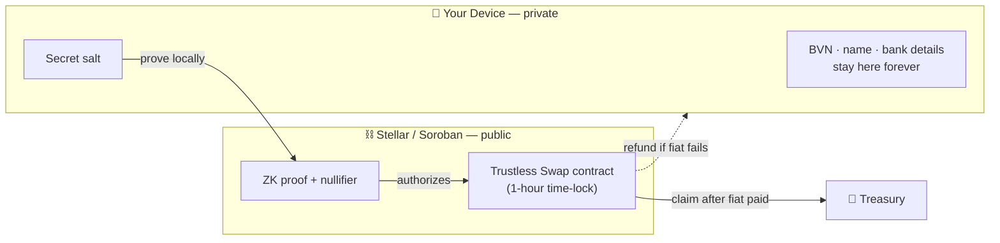
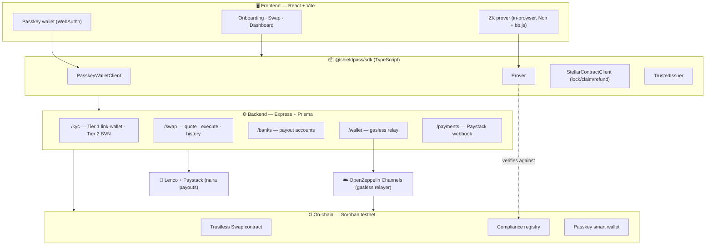
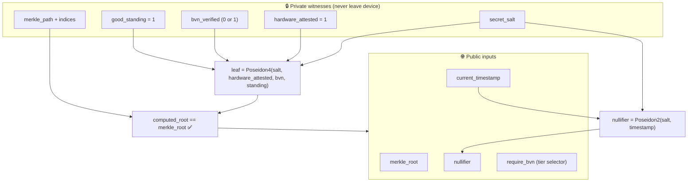
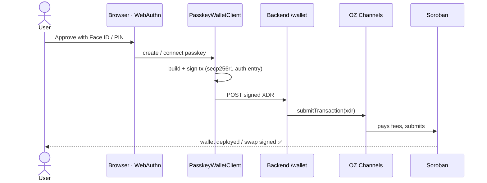
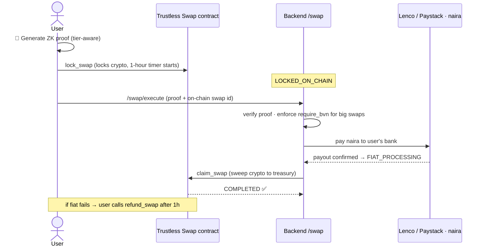
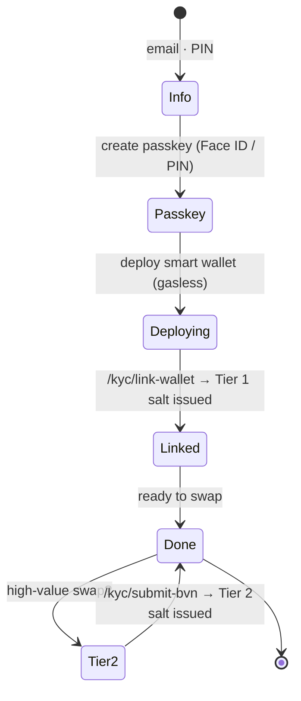

# 🛡️ ShieldPass

### Zero-Knowledge, trustless crypto → naira instant off-ramp on Stellar

ShieldPass lets anyone swap crypto for Nigerian naira **instantly**, paid straight to their bank account — **without ever exposing their identity or banking data on-chain**. You prove you're a verified, compliant human with a **zero-knowledge proof** generated entirely on your device; the chain only ever sees the proof, never your BVN, name, or bank details. Your crypto is held in a **trustless time-lock** — if the naira payout ever fails, the contract refunds you automatically. Wallets are **passkeys** (Face ID / fingerprint / device PIN), and every on-chain action is **gasless**.

> **Built for the _Stellar Hacks: ZK_ hackathon.** The ZK proof is *load-bearing* — it is the compliance gate for every swap, not a decorative add-on.

<p align="center">
  <code>ZK Compliance</code> • <code>Passkey Smart Wallets</code> • <code>Gasless</code> • <code>Soroban / Stellar Testnet</code> • <code>Noir + Poseidon</code>
</p>

---

## 🧭 The big idea

Traditional off-ramps force you to upload your identity and trust a custodian with your funds. ShieldPass removes both. Your sensitive data stays on your device; a cryptographic proof travels in its place; and a smart contract — not a middleman — holds your crypto in a **time-locked swap** until the fiat lands. If the payout fails, you reclaim your crypto trustlessly after one hour.



**What's public:** a proof and a time-bound nullifier.
**What's private:** literally everything that identifies you.

---

## 🪜 Progressive KYC — programmable privacy

ShieldPass uses a **tiered** compliance model so small swaps stay frictionless while large ones stay regulated:

| Tier | Gate | Unlocks |
|---|---|---|
| **Tier 1** | Passkey **hardware attestation** (`hardware_attested`) | Everyday swaps |
| **Tier 2** | **BVN** verification (`bvn_verified`) | High-value swaps (> ₦1,000,000) |

The *same* circuit enforces both. A public input `require_bvn` is set by the backend based on the swap's naira value: when it's `1`, the proof must additionally prove `bvn_verified == 1`. A Tier 1 user never submits a BVN at all — it's only requested when they cross the threshold.

---

## 🏗️ Architecture

ShieldPass is a monorepo: a TypeScript **SDK** (the reusable core), a Node **backend** (relays + onboarding + swap engine), a React **frontend**, and **Soroban contracts** on Stellar.



---

## 🔐 How the zero-knowledge proof works

When you link a passkey wallet, your compliance attributes (`hardware_attested`, `bvn_verified`, `good_standing`) plus a private `secret_salt` are hashed into a **leaf commitment** and inserted into a published **Merkle tree** of verified users. To swap, you generate a Noir proof that:

1. your leaf is a member of the published tree (Merkle membership), **and**
2. `hardware_attested == 1` and `good_standing == 1` (always), **and** `bvn_verified == 1` **only if** `require_bvn == 1` (Tier 2), **and**
3. you derive a valid **nullifier** = `Poseidon(secret_salt, timestamp)` — a reusable, time-bound pass that prevents linking swaps back to you.



> Circuit: `SDK/circuits/reusable_kyc` (Noir, BN254 Poseidon, depth-8 tree). One reusable proof gates every swap; `require_bvn` flips it between Tier 1 and Tier 2.

---

## 🔑 Passkey smart wallets (gasless)

No seed phrases, no browser extensions, no XLM required. Each user gets a **smart-contract wallet** secured by a WebAuthn passkey. Signing happens with Face ID, a fingerprint, or your **device PIN** (e.g. Windows Hello) — and transactions are submitted **gaslessly** through the OpenZeppelin Channels relayer.



> **No biometric hardware?** A Windows Hello **PIN** works as the passkey gesture, or scan the prompt's QR code to approve with your phone.

---

## 🔄 The trustless swap lifecycle

The user locks crypto on-chain (gated by a fresh ZK proof). The backend verifies the proof, pushes naira to the user's bank account, then claims the crypto into the treasury. If the fiat never arrives, the user reclaims their crypto after the 1-hour time-lock — no trust required.



**Contract entry points** (`SDK/contracts/shielded_pool`):
- `lock_swap(user, token_address, amount, nullifier) -> swap_id` — locks any Stellar asset.
- `claim_swap(swap_id)` — admin-only, after the fiat payout succeeds; sweeps crypto to the treasury.
- `refund_swap(swap_id)` — user-only, after the 1-hour (3600s) time-lock; returns the crypto trustlessly.

---

## 🧩 Onboarding flow (passkey-first)



No BVN is collected up front — onboarding is just **email + PIN + passkey**. BVN is requested only when a user attempts a swap above the Tier 2 threshold.

---

## 🛠️ Tech stack

| Layer | Tech |
|---|---|
| **ZK** | Noir circuits, Poseidon (BN254), `bb.js` prover in-browser |
| **Smart contracts** | Rust / Soroban — trustless swap (time-lock) + compliance registry |
| **Wallets** | `passkey-kit` smart wallets (WebAuthn / secp256r1) |
| **Gasless relay** | OpenZeppelin Channels |
| **SDK** | TypeScript (`@shieldpass/sdk`) |
| **Backend** | Node, Express, Prisma 7 + Neon Postgres (`@prisma/adapter-pg`) |
| **Frontend** | React, Vite, Tailwind, Framer Motion |
| **Fiat payouts** | Lenco Business Banking + Paystack (redundant naira off-ramp) |
| **Network** | Stellar / Soroban **testnet** |

---

## 📁 Repository structure

```
ShieldPass/
├── SDK/              @shieldpass/sdk — prover, swap contract client, passkey wallet, ZK circuit
│   ├── circuits/reusable_kyc/        Noir progressive-KYC membership circuit
│   └── contracts/shielded_pool/      Soroban Trustless Swap contract (lock/claim/refund)
├── backend/          Express API — /kyc /swap /banks /wallet /payments + Prisma
├── frontend/         React app — onboarding, swap, dashboard
├── frontend-tester/  Minimal harness for the passkey + swap smoke tests
└── docs/             Specs & implementation plans
```

---

## 📦 Using the SDK

> Full developer docs live on the in-app **Docs** page. Quick start:

```bash
npm install @shieldpass/sdk
```

```ts
import { StellarContractClient } from '@shieldpass/sdk'
// Browser-only passkey wallet is a deep import (keeps it off the backend):
import { PasskeyWalletClient } from '@shieldpass/sdk/dist/passkey'

// 1. Create a passkey smart wallet (Face ID / fingerprint / PIN)
const wallet = new PasskeyWalletClient({ rpcUrl, networkPassphrase, walletWasmHash })
const { keyId, contractId } = await wallet.createWallet('ShieldPass', userEmail)

// 2. Generate a ZK compliance proof in-browser, then lock the crypto for a swap
const stellar = new StellarContractClient(rpcUrl, networkPassphrase, swapContractId)
const { swapId } = await stellar.lockSwap(
  { userWallet: contractId, tokenAddress, amount, nullifier },
  { kind: 'passkey', sign: (xdr) => wallet.sign(xdr, keyId), submit: submitSignedXdr },
)
```

**Best-fit apps:** KYC-gated off-ramps, privacy-preserving compliance flows, and any Stellar app that wants **gasless passkey wallets** + **on-chain proof of identity without doxxing the user**.

---

## 🚀 Local development

**Prerequisites:** Node 20+ (Prisma 7 requires ≥ 20.19), a backend `.env`, and a frontend `.env`.

```bash
# Backend — `prisma generate` is required (the v7 client is gitignored, not in node_modules)
cd backend && npm install && npx prisma generate && npm run dev   # http://localhost:3001

# Frontend
cd frontend && npm install && npm run dev      # http://localhost:5173
```

Build & deploy the Soroban contract (needs the `wasm32v1-none` target / `stellar` CLI):

```bash
cd SDK/contracts/shielded_pool && stellar contract build
# then deploy, and call init(<admin/treasury address>); set STELLAR_CONTRACT_ID
```

Key environment variables:

| File | Var | Purpose |
|---|---|---|
| `backend/.env` | `NEON_CONNECTION_STRING` | Neon Postgres **direct** URL — append `?sslmode=require&uselibpqcompat=true`, no `channel_binding` (used by both the Prisma adapter at runtime and `prisma.config.ts` for migrations) |
| `backend/.env` | `CHANNELS_URL` / `CHANNELS_API_KEY` | OpenZeppelin Channels gasless relayer ([get a key](https://channels.openzeppelin.com/testnet/gen)) |
| `backend/.env` | `STELLAR_CONTRACT_ID` / `STELLAR_RELAYER_SECRET` | Trustless Swap contract id + the admin keypair that signs `claim_swap` |
| `backend/.env` | `LENCO_API_KEY` / `LENCO_ACCOUNT_ID` · `PAYSTACK_SECRET_KEY` | Naira payouts (redundant providers; payouts are mocked if unset) |
| `backend/.env` | `SWAP_RATES` / `SWAP_DEFAULT_RATE` / `TIER2_THRESHOLD_NAIRA` | Quote pricing + the high-value (Tier 2 / BVN) threshold |
| `frontend/.env` | `VITE_WALLET_WASM_HASH`, `VITE_ESCROW_CONTRACT_ID`, `VITE_*_SAC` | On-chain IDs the swap flow needs (`VITE_ESCROW_CONTRACT_ID` = the swap contract) |

---

## 🔒 Security & production notes

- **Testnet demo.** Built for the hackathon on Stellar testnet — not for real-fund custody.
- **Trustless by design.** Crypto sits in a time-locked contract; if the backend never pays the fiat and calls `claim_swap`, the user reclaims their funds via `refund_swap` after one hour. The platform can never simply take the crypto.
- **Passkey-kit is unaudited demo material.** It's the legacy precursor to OpenZeppelin's audited **Smart Accounts**; the documented production path is to migrate to [`smart-account-kit`](https://github.com/kalepail/smart-account-kit) before any mainnet use.
- **Single-signer wallets.** Lose the passkey device and the wallet is unrecoverable unless a backup signer is added (`add_signer` exists in the wallet contract).
- The ZK gate is real and load-bearing: no valid (tier-appropriate) proof ⇒ no swap.

---

## 📜 License

See [LICENSE](./LICENSE).
