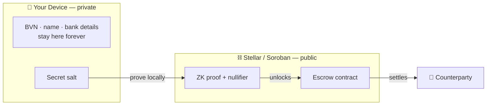
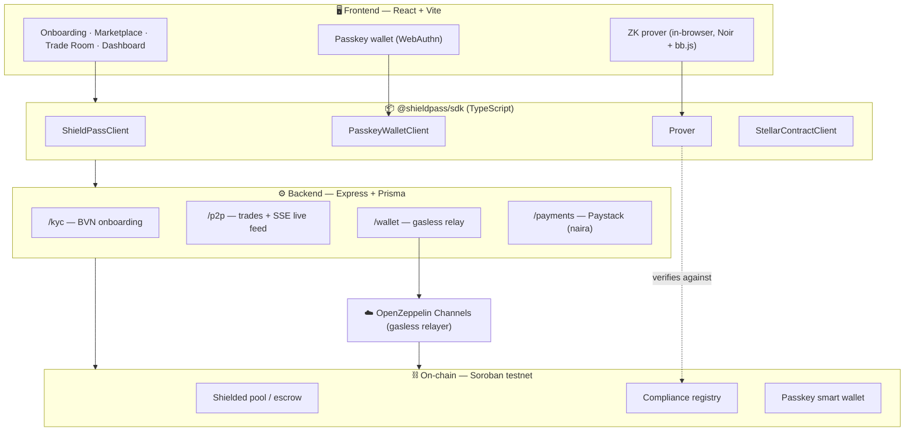
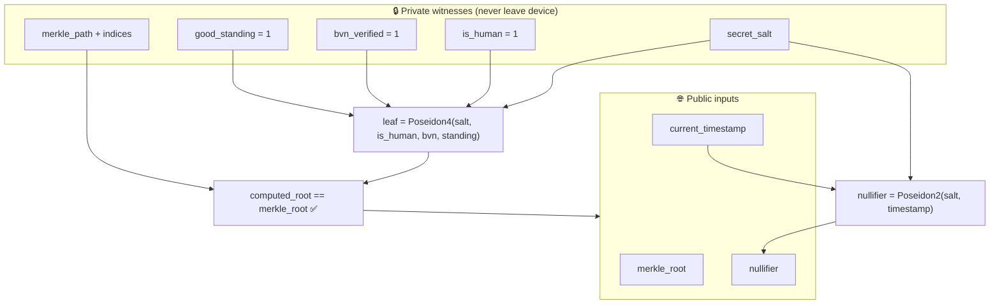
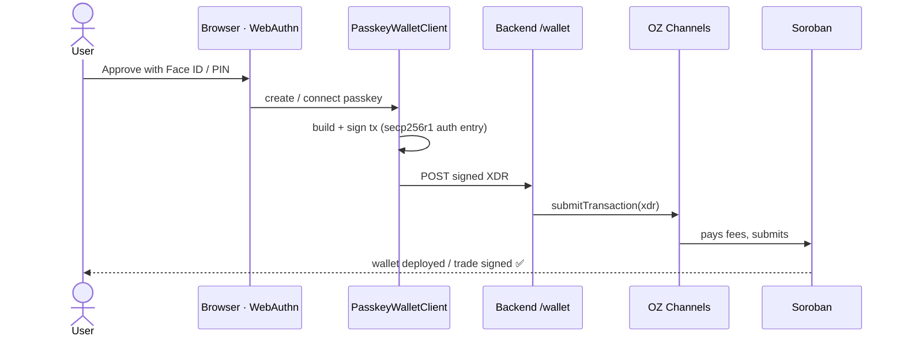
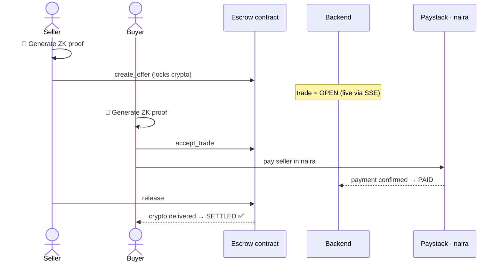
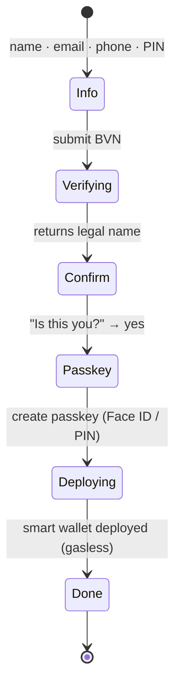

# 🛡️ ShieldPass

### Zero-Knowledge, private P2P crypto ⇄ naira exchange on Stellar

ShieldPass lets people trade crypto for Nigerian naira **without ever exposing their identity or banking data on-chain**. You prove you're a verified, compliant human with a **zero-knowledge proof** generated entirely on your device — the chain only ever sees the proof, never your BVN, name, or bank details. Wallets are **passkeys** (Face ID / fingerprint / device PIN), and every on-chain action is **gasless**.

> **Built for the _Stellar Hacks: ZK_ hackathon.** The ZK proof is *load-bearing* — it is the compliance gate for every trade, not a decorative add-on.

<p align="center">
  <code>ZK Compliance</code> • <code>Passkey Smart Wallets</code> • <code>Gasless</code> • <code>Soroban / Stellar Testnet</code> • <code>Noir + Poseidon</code>
</p>

---

## 🧭 The big idea

Traditional P2P exchanges force you to upload your identity and trust a custodian with your funds. ShieldPass removes both. Your sensitive data stays on your device; a cryptographic proof travels in its place; and a smart contract — not a middleman — holds funds in escrow until both sides settle.



**What's public:** a proof and a time-bound nullifier.
**What's private:** literally everything that identifies you.

---

## 🏗️ Architecture

ShieldPass is a monorepo: a TypeScript **SDK** (the reusable core), a Node **backend** (relays + onboarding), a React **frontend**, and **Soroban contracts** on Stellar.



---

## 🔐 How the zero-knowledge proof works

During onboarding, your compliance attributes (`is_human`, `bvn_verified`, `good_standing`) plus a private `secret_salt` are hashed into a **leaf commitment** and inserted into a published **Merkle tree** of verified users. To trade, you generate a Noir proof that:

1. your leaf is a member of the published tree (Merkle membership), **and**
2. all three compliance flags equal `1`, **and**
3. you derive a valid **nullifier** = `Poseidon(secret_salt, timestamp)` — a reusable, time-bound pass that prevents linking trades back to you.



> Circuit: `SDK/circuits/reusable_kyc` (Noir, BN254 Poseidon, depth-8 tree). The same proof gates **both** creating and accepting a trade.

---

## 🔑 Passkey smart wallets (gasless)

No seed phrases, no browser extensions, no XLM required. Each user gets a **smart-contract wallet** secured by a WebAuthn passkey. Signing happens with Face ID, a fingerprint, or your **device PIN** (e.g. Windows Hello) — and transactions are submitted **gaslessly** through the OpenZeppelin Channels relayer.



> **No biometric hardware?** A Windows Hello **PIN** works as the passkey gesture, or scan the prompt's QR code to approve with your phone.

---

## 🔄 The P2P trade lifecycle

A seller locks crypto in escrow (gated by a fresh ZK proof). A buyer accepts (also ZK-gated), pays naira off-chain via Paystack, and the contract releases the crypto on confirmation. A live SSE feed keeps both parties' UIs in sync.



---

## 🧩 Onboarding flow



---

## 🛠️ Tech stack

| Layer | Tech |
|---|---|
| **ZK** | Noir circuits, Poseidon (BN254), `bb.js` prover in-browser |
| **Smart contracts** | Rust / Soroban — escrow (shielded pool) + compliance registry |
| **Wallets** | `passkey-kit` smart wallets (WebAuthn / secp256r1) |
| **Gasless relay** | OpenZeppelin Channels |
| **SDK** | TypeScript (`@shieldpass/sdk`) |
| **Backend** | Node, Express, Prisma, SSE |
| **Frontend** | React, Vite, Tailwind, Framer Motion |
| **Payments** | Paystack (naira on/off-ramp) |
| **Network** | Stellar / Soroban **testnet** |

---

## 📁 Repository structure

```
ShieldPass/
├── SDK/              @shieldpass/sdk — prover, contracts client, passkey wallet, ZK circuit
│   └── circuits/reusable_kyc/   Noir KYC-membership circuit
├── backend/          Express API — /kyc /p2p /wallet /payments + Prisma
├── frontend/         React app — onboarding, marketplace, trade room, dashboard
├── frontend-tester/  Minimal harness for the passkey + trade smoke tests
└── docs/             Specs & implementation plans
```

---

## 📦 Using the SDK

> Full developer docs live on the in-app **Docs** page. Quick start:

```bash
npm install @shieldpass/sdk
```

```ts
import { ShieldPassClient } from '@shieldpass/sdk'
// Browser-only passkey wallet is a deep import (keeps it off the backend):
import { PasskeyWalletClient } from '@shieldpass/sdk/dist/passkey'

// 1. Create a passkey smart wallet (Face ID / fingerprint / PIN)
const wallet = new PasskeyWalletClient({ rpcUrl, networkPassphrase, walletWasmHash })
const { keyId, contractId } = await wallet.createWallet('ShieldPass', userEmail)

// 2. Generate a ZK compliance proof + drive the trade lifecycle
const client = new ShieldPassClient(/* ...config... */)
```

**Best-fit apps:** KYC-gated P2P marketplaces, privacy-preserving compliance flows, and any Stellar app that wants **gasless passkey wallets** + **on-chain proof of identity without doxxing the user**.

---

## 🚀 Local development

**Prerequisites:** Node 18+, a backend `.env`, and a frontend `.env`.

```bash
# Backend
cd backend && npm install && npm run dev      # http://localhost:3001

# Frontend
cd frontend && npm install && npm run dev      # http://localhost:5173
```

Key environment variables:

| File | Var | Purpose |
|---|---|---|
| `backend/.env` | `CHANNELS_URL` / `CHANNELS_API_KEY` | OpenZeppelin Channels gasless relayer ([get a key](https://channels.openzeppelin.com/testnet/gen)) |
| `backend/.env` | `WALLET_WASM_HASH` | Uploaded passkey smart-wallet wasm hash |
| `backend/.env` | `STELLAR_RELAYER_SECRET` | Testnet deployer account |
| `backend/.env` | `PAYSTACK_SECRET_KEY` | Naira payments (test) |
| `frontend/.env` | `VITE_WALLET_WASM_HASH`, `VITE_ESCROW_CONTRACT_ID`, `VITE_TOKEN_CONTRACT_ID`, `VITE_*_SAC` | On-chain IDs the trade loop needs |

---

## 🔒 Security & production notes

- **Testnet demo.** Built for the hackathon on Stellar testnet — not for real-fund custody.
- **Passkey-kit is unaudited demo material.** It's the legacy precursor to OpenZeppelin's audited **Smart Accounts**; the documented production path is to migrate to [`smart-account-kit`](https://github.com/kalepail/smart-account-kit) before any mainnet use.
- **Single-signer wallets.** Lose the passkey device and the wallet is unrecoverable unless a backup signer is added (`add_signer` exists in the wallet contract).
- The ZK gate, however, is real and load-bearing: no valid proof ⇒ no trade.

---

## 📜 License

See [LICENSE](./LICENSE).
